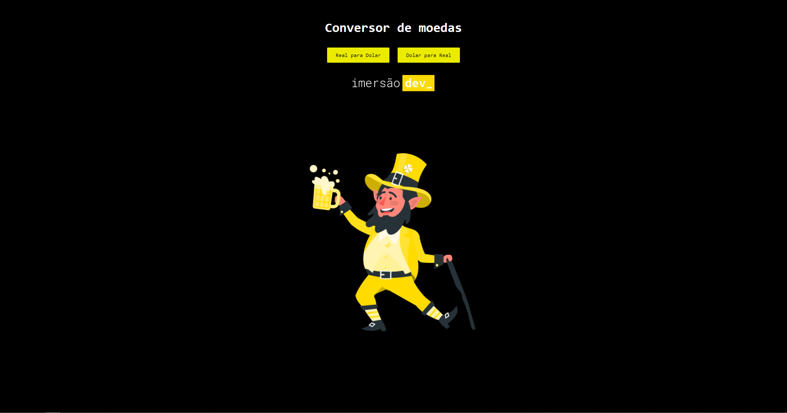

<h1 align="center">
Currency Converter 💵
</h1>

Currency converter that converts Real into Dollar and Dollar into Real.

Project developed at the Event Imersão Dev of Alura.

# What is Imersão Dev?

The event "Imersão Dev" is a series of ten classes focused on JavaScript in practice, HTML and CSS, offered by the online technology teaching platform Alura.

# Project layout

In the project was developed a layout by Alura, but I decided to redo it and stayed the way it portrays the image below.

